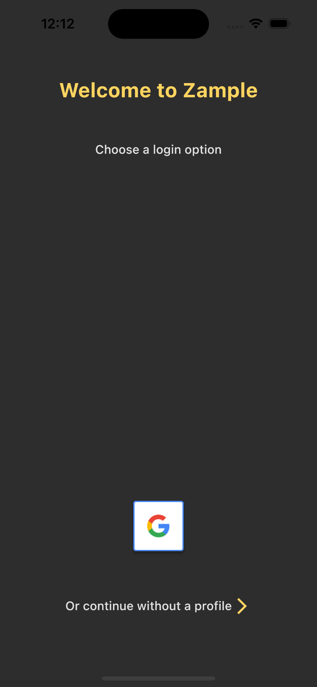
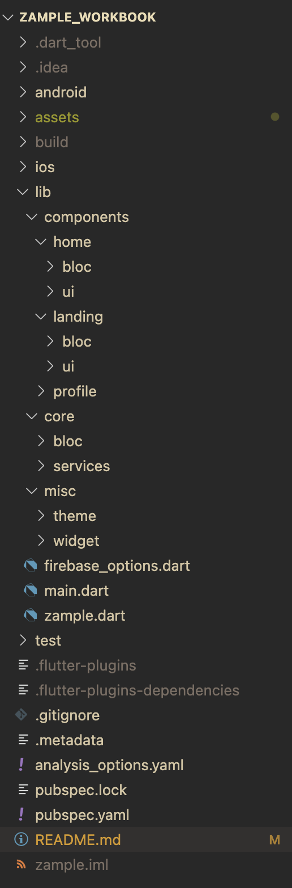

# Zample Workbook Part 1

A Social Media Mobile Application Template, built with Flutter and Firebase.

This is Part 1 of a 3 part series, detailling:
- General Setup (Seperation of BL, UI and Repo, Project Structure)
- Firebase Setup 
- Firebase Auth (Google Auth)

## Prerequisite Applications

Make sure that you have installed Flutter/Dart on your machine. I personally work with VSCodium (an open source alternative to Visual Studio Code), but you can also work with Android Studio.

If you want to speed up the process of connecting to Firebase, I recommend you to install [Firebase CLI](https://firebase.google.com/docs/cli). 

## Prerequisite Knowledge

This project requires intermediate knowledge of Flutter, [BLoC/Cubit](https://bloclibrary.dev/#) as well as Firebase. 

When you are ready, start off with creating a Flutter Project!

 ```flutter create --org com.yourdomain your_app_name``` 

## About the Project

"Zample" is a template for a mobile social media application using Flutter/Firebase.

It follows common practices like seperation of UI, BL (Business Logic) and Repo, while still managing to be quite simplistic.

Since Flutter is heavily supported by Google, and the integration of between both environments are great, I chose to work with Firebase as a Database Provider (Firebase Cloud Firestore mainly).

Zample uses the BLoC/Cubit state management library, and the popular [Get-It](https://pub.dev/packages/get_it) package, that supports the easy accessing of objects, without ```BuildContext```, while still having O(1).

The Project takes some inspiration from [Harpy](https://github.com/robertodoering/harpy), a Twitter clone built in Flutter. Be sure to check them out.

The final goal of this project (Part 1-3) is to have stable fundament. This means the application can:

- CRUD User Accounts (also allow non-authenticated users to access the application without us)
- CRUD User generated Content (Posts)

# Documentation


## Final Results

These are the screenshots of the final result for Part 1. Doesn't seem like a lot, but the underlying fundament is the main focus of the course. 

**Landing Screen**



The page is compromised of a Social Auth Google Icon and a No-Auth alternative. The user needs to register with 

**Home Screen**


This page comes if the user has either successfully logged in or has used the No-Auth alternative.

**Project Structure**



This is the general structure of the project. 

## Firebase Setup


To first initialize Firebase to the project, we need to work on setting up the Project with Firebase.

To do this, I recommend using the [Firebase CLI](https://firebase.google.com/docs/cli).

If you don't want to use the Firebase CLI, you can manually setup the Project inside Fireabase.

After successfull installation, an autogenerated file ("firebase_options.dart") should appear on your screen.

**Important**: For mobile apps, you still need some additional configurations! Without those, the Application initialized with ```Firebase.initializeApp()``` won't work!

**Note:** Remember adding the GoogleService-Info.plist and google-service.json to your project! More information can be found [here](https://firebase.google.com/docs/flutter/setup?platform=ios)


### SHA Keys and additional Firebase Setup

For Android Projects, you need to access SHA Keys and add them to your Firebase Demo Project.

The SHA Keys can be generated. Click [here](https://stackoverflow.com/questions/51845559/generate-sha-1-for-flutter-react-native-android-native-app) to get more information.

Your main.dart should look somewhat like that:

```dart

void main() async {
  WidgetsFlutterBinding.ensureInitialized();

  SystemChrome.setPreferredOrientations([
    DeviceOrientation.portraitUp,
    DeviceOrientation.portraitDown,
  ]);

  Firebase.initializeApp();

  runApp(myApp());
}
```

## Get-It + GlobalBlocProvider 

### Get-It

To have a service locator, we need to instantiate the Get-It Package at first. Add the get_it package to your your project.
Create a file called service_locator.dart and add the following code: 

```dart

final GetIt app = GetIt.instance;

void setupServices(){
    /// we will later setup the Services here
}

```

Add the class setupServices in main.dart underneath Firebase.initializeApp().


### GlobalBlocProvider

First add the flutter_bloc package to your library. The "GlobalBlocProvider" will be a [MultiBlocProvider](https://pub.dev/documentation/flutter_bloc/latest/flutter_bloc/MultiBlocProvider-class.html) that instantiates all necessary BlocProviders from the start of the application, making them later usable via Dependency Injection.

It is important to wrap the GlobalBlocProvider around MyApp.dart, meaning that in main.dart, your code should similar to this:

```dart

void main() async {
  WidgetsFlutterBinding.ensureInitialized();

  SystemChrome.setPreferredOrientations([
    DeviceOrientation.portraitUp,
    DeviceOrientation.portraitDown,
  ]);

  Firebase.initializeApp();
  /// I've changed the name of myApp() to Zample and converted Zample into a [Stateless Widget] 
  runApp(const GlobalBlocProvider(child: Zample()));
}

```
Meanwhile your GlobalBlocProvider class should be similar to this:

```dart

class GlobalBlocProvider extends StatelessWidget {
  const GlobalBlocProvider({super.key, required this.child});
  final Widget child;

  @override
  Widget build(BuildContext context) {
    return MultiBlocProvider(providers: [
      /// Future BlocProvidersand their Cubits will be in here
    ], child: child);
  }
}

```

## Theme + Colours

Now to the colours: You can potentially skip this part, since it has no functional effect on the application, it just simplifies how the Theme is instantiated.

I personally used three colours for the application, you can find them under colors.dart.

```dart

const yellowColor = Color.fromRGBO(255, 212, 95, 1);
const lightGreyColor = Color.fromRGBO(224, 224, 224, 1);
const darkGreyColor = Color.fromRGBO(45, 45, 45, 1);
```

The theme is mostly compromised of textThemes, and will be used in the later parts of the series as the baseline.

```dart

ThemeData darkTheme = ThemeData(
  textTheme: const TextTheme(
    displayLarge: TextStyle(
        fontSize: 25.0, color: yellowColor, fontWeight: FontWeight.bold),
    displayMedium: TextStyle(fontSize: 25.0, color: lightGreyColor),
    titleLarge: TextStyle(fontSize: 15.0, color: lightGreyColor),
    titleMedium: TextStyle(fontSize: 12.0, color: yellowColor),
    titleSmall: TextStyle(fontSize: 10.0, color: lightGreyColor),
    headlineMedium: TextStyle(fontSize: 15.0, color: yellowColor),
  ),
  primaryColor: lightGreyColor,
  highlightColor: yellowColor,
  bottomNavigationBarTheme: ThemeData.light().bottomNavigationBarTheme.copyWith(
        selectedItemColor: yellowColor,
        unselectedItemColor: darkGreyColor,
        showUnselectedLabels: false,
      ),
);

```

## Navigator Service

Lets go to the interesting Parts of the Application:
Inside Zample.dart (MyApp.dart) create a regular MaterialApp child inside a WillPopScope class. The WillPopScope class will be used to manipulate whether the Application can be "popped" by using any back button.

now you can assign a theme to the MaterialApp, as well as do some other minor configurations.

How does the application know where to navigate without a dedicated home route? - That's where the navigatorService will come in handy.

For this create a seperate class called NavigatorService and a enum called RouteType above that. The enum in this example will only have "defaultRoute" as a value, but depending on how extensive you want the navigatorService to be, you can add other RouteTypes and change their behaviour on that.

First call the NavigatorState inside a GlobalKey - a unique key identifier in your app. Then add a RouteObserver with a dynamic PageRoute.

Your code should look like this:

```dart 

enum RouteType{
    defaultRoute
}

class NavigatorService{
    final GlobalKey<NavigatorState> key = GlobalKey<NavigatorState>();

    final RouteObserver<PageRoute<dynamic>> routeObserver = RouteObserver<PageRoute<dynamic>>();

}

```

Now we need to get the current NavigatorState to the GlobalKey.currentstate. We add ```NavigatorState? get state => key.currentState;```.
To later initialize the initialRoute of the Application, we create a late String called initialRoute.
Inside the constructor of NavigatorService the initialRoute will be initialized to the Application. To know where to lead the current Session, we need to know whether there is an authenticated Firebase User.

### getCurrentUser()

Before initializing the constructor we first need to create a getCurrentUser method that gets the current FirebaseUser.

We create a class called FirebaseAuthRepository and add the following code

```dart 
class FirebaseAuthRepository {
    final FirebaseAuth _firebaseAuth;

    FirebaseAuthRepository({FirebaseAuth? firebaseAuth}): _firebaseAuth = firebaseAuth ?? FirebaseAuth.instance;

    User? getCurrentUser(){
        final User? user = _firebaseAuth.currentUser;
        if(null!= user) {
            user.reload();
        }
        return user;
    }
}

```

The getCurrentUser method checks whether a user exists. If an authenticated user exists, the user gets refreshed, otherwise the method returns null.
We now need to add the FirebaseAuthRepository to the service locator. This is done by adding a LazySingleton of the class to the the GetIt.instance. In short the method looks like this:


```dart

setupServices(){
    app.registerLazySingleton<FirebaseAuthRepository>(() => FirebaseAuthRepository());
}

```

Back to the NavigatorService class: We need to add the FirebaseAuthRepository (and the method getCurrentUser) as well as a ternary operator to get the intialRoute for the Session. 
For this we need to create two StatelessWidgets and their routes: HomeScreen and LandingScreen. Inside both classes you need to create a String called "route" that assigns the name of the specific route. The Screens should look somewhat like this:


```dart

 /// [LandingScreen] is essentially the same thing 
class HomeScreen extends StatelessWidget{
    /// the corresponding route that can be statically called
    static const String route = "home_screen";

    const HomeScreen({super.key});

    @override 
    Widget build(BuildContext context){

        return UnimplementedError();
    }
    
}

```

Now we can finally add the Constructor of NavigatorService with all its parts together. As mentioned, we will use a ternary operator to simplify the code:

``` dart 

NavigatorService(){
    initialRoute = app.get<FirebaseAuthRepository>().getCurrentUser() != null 
        ? HomeScreen.route 
        : LandingScreen.route; 
}

```
If the User is authenticated, the initialRoute will be HomeScreen, otherwise its LandingScreen.

We have now specified the initalRoute, but we need methods to push, and replace Routes based on how we want to structure our navigation tree. 
For that, we need to essentially create three methods (in this part only one of them is used, but for future use cases we will implement everything now):

- pushRoute: a simple method to push a new Route to the Navigator

- pushNamed: a convenience method to push a named route to the Navigator 

- pushReplacementNamed: a method to push a named replacement route to the Navigator

To make it easy, the code should look like that:

```dart 

void pushRoute(Route<void> route){
    key.currentState!.push<void>(route);
}

void pushReplacement(String route, {RouteType type = RouteType.defaultReoute, Map<String, dynamic>? arguments}){
    key.currentState?.pushReplacementNamed<void, void>(route, arguments: <String, dynamic>{
        "routeType" : type, 
        ...?arguments,
    });
}

void pushNamed(
    String route, {
    RouteType type = RouteType.defaultRoute, Map<String, dynamic>? arguments,
    }){
        key.currentState?.pushNamed<void>(route, arguments: <String, dynamic>{
            "routeType": type,
        }..addAll(arguments ?? {}),
    );
}

```

To close off the class we still need to define onGenerateRoute, a method that gets called when a new named route is being pushed to the app. 
To do this we create this method inside NavigatorService.

```dart
  Route<dynamic> onGenerateRoute(RouteSettings settings) {
    final routeName = settings.name;

    final arguments = settings.arguments as Map<String, dynamic>?;

    final routeType = arguments?['routeType'] as RouteType?;
    Widget screen;

    switch (routeName) {
      case LandingScreen.route:
        screen = const LandingScreen();
        break;
      case HomeScreen.route:
        screen = const HomeScreen();
        break;
      default:
        screen = const HomeScreen();
        break;
    }

/// not necessary code, since [RouteType] is always [RouteType.defaultRoute]
/// if you want to add another RouteType, you need to specifiy the conditions here
    switch (routeType) {
      case RouteType.defaultRoute:
      default:
        return CupertinoPageRoute<void>(
          builder: (_) => screen,
          settings: RouteSettings(name: routeName, arguments: arguments),
        );
    }
  }
}

```

Well done, the Navigatorservice class is done! We can now work on implementing the methods into the Zample class. First add the NavigatorService class to GetIt. Now you can define the methods in the MaterialApp based upon those we created. Your Zample class should look similar to this:

```dart

class Zample extends StatelessWidget {
  const Zample({super.key});

  @override
  Widget build(BuildContext context) {
    return WillPopScope(
      child: MaterialApp(
        theme: darkTheme,
        debugShowCheckedModeBanner: false,
        navigatorKey: app.get<NavigatorService>().key,
        onGenerateRoute: app.get<NavigatorService>().onGenerateRoute,
        initialRoute: app.get<NavigatorService>().initialRoute,
      ),
      onWillPop: () async => false,
    );
  }
}
 
```
By now, the app automatically assigns the navigatorKey from the NavigatorService as its GlobalKey for navigation and assigns an initialRoute depending on whether an user is authenticated or not.

Congrats, we can now work on the initial Firebase Profile and Profile Repository.

## Profile (Repo)

For the Profile class we will be using the package [Equatable](https://pub.dev/packages/equatable), that solves many issues in dart regarding Equality Comparisons.
With every new authentication, we want to create a unique profile for the user, in which he can manipulate his user data. For now this data will only consist of three variables:

- uid: a unique Firebase Id that categorizes the profile document

- avatarUrl: link to the current profile picture of the user 

- username: Username composed of parts of the given email

**Note:** The variables are set unchanged for now, since this Part does not cover Profile customization. If you already want to add other variables, feel free to do so.

Because Firebase No-SQL Database uses Json documents, we need methods to convert documents to and from Json.

Your Code should look similarly to this:

```dart

class Profile extends Equatable{
  final String uid;
  final String avatarUrl;
  final String username;

  const Profile({
    required this.uid,
    required this.avatarUrl,
    required this.username,
  });

  factory Profile.fromJson(Map<String, dynamic> map) => Profile(
        uid: map["uid"] as String,
        avatarUrl: map["avatarUrl"] as String,
        username: map["username"] as String,
      );

  Map<String, dynamic> toJson() => {
        "uid": uid,
        "avatarUrl": avatarUrl,
        "username": username,
      };

  Profile copyWith({
    String? uid,
    String? avatarUrl,
    String? email,
    String? username,
  }) =>
      Profile(
        uid: uid ?? this.uid,
        avatarUrl: avatarUrl ?? this.avatarUrl,
        username: username ?? this.username,
      );

  @override
  List<Object?> get props => [uid, avatarUrl, username];
}

```

To make necessary CRUD Operations we need to have a Repository class that handles all the methods. Create a "FirebaseProfileRepository" and add a final CollectionReference that instantiates a Firestore Collection (I named the collection profile, you can change the naming here):
```final CollectionReference _profileCollection = FirebaseFirestore.instance.collecetion("profile"); ```

The Profile Repository needs the following components: 

- create: create a profile document in the profile 
- delete: delete the profile document 
- get: access the document data 
- exists: does the document exist? 
- update: update the current profile document

To access multiple data streams one after the other, it would also be efficient to have a profileStream that accesses document snapshots.

Your final file should ergo look somewhat like this:

```dart
final CollectionReference _profileCollection =
      FirebaseFirestore.instance.collection("profile");

  Future<void> create({required Profile profile}) {
    return _profileCollection
        .doc(FirebaseAuth.instance.currentUser!.uid)
        .set(profile.toJson());
  }

  Future<void> delete() async {
    return _profileCollection
        .doc(FirebaseAuth.instance.currentUser!.uid)
        .delete();
  }

  Future<Profile> get() async {
    final DocumentSnapshot document = await _profileCollection
        .doc(FirebaseAuth.instance.currentUser!.uid)
        .get();
    return Profile.fromJson(document.data() as Map<String, dynamic>);
  }

  Future<bool> exists() async {
    final DocumentSnapshot document = await _profileCollection
        .doc(FirebaseAuth.instance.currentUser!.uid)
        .get();
    return document.exists;
  }

  Future<void> update({required Profile profile}) async {
    return _profileCollection
        .doc(FirebaseAuth.instance.currentUser!.uid)
        .update(profile.toJson());
  }

  Stream<Profile> get profileStream => _profileCollection
      .doc(FirebaseAuth.instance.currentUser!.uid)
      .snapshots()
      .map((snapshot) =>
          Profile.fromJson(snapshot.data() as Map<String, dynamic>));

```
**Note:** To later access those functionalities, add the FirebaseProfileRepository to GetIt.

## Firebase Auth 

We now have developed the baseline for profile creation, but didnt really look into the authentication Process itself.
The Project itself allows only Google Authentication, since it is easily integrated with Firebase/Flutter.
To add different Authentication methods click [here](https://firebase.google.com/docs/auth).

First of all, allow Google Authentication to work withing Firebase. In your Firebase Project Demo, enable Google (under your Authentication Tab) and add your project name and support email.
Add the Support Email under also under Firebase project settings -> General.
As for Android, you are done! 
For iOS machines you will need to do one more thing:
Go to your project directory and add this under the project directory -> ios -> Runner -> Info.plist file:

```xml
<!-- Put me in the [my_project]/ios/Runner/Info.plist file -->
<!-- Google Sign-In section -->
<key>CFBundleURLTypes</key>
<array>
	<dict>
		<key>CFBundleTypeRole</key>
		<string>Editor</string>
		<key>CFBundleURLSchemes</key>
		<array>
			<!-- TODO Replace this value: -->
			<!-- Copied from GoogleService-Info.plist key REVERSED_CLIENT_ID -->
			<string>com.googleusercontent.apps.861823949799-vc35cprkp249096uujjn0vvnmcvjppkn</string>
		</array>
	</dict>
</array>
<!-- End of the Google Sign-In section -->
```
You are now ready to go, now lets revisit our FirebaseAuthRepository!

### Firebase Auth Repository 

Currently you should only have the firebaseAuth variable and the getCurrentUser method.
For Google Authentication to work we need a way to login a user and also sign him out. 
For that we will need the final variable GoogleSignIn. With that being said - we also need to initialize the GoogleSignIn variable within the constructor. For that we will use the ```GoogleSignIn.standard()``` method.

To add the functionality of the user actually login into google we will create an asynchronous function that triggers the authentication flow, obtains the auth details from the request, creates thus a new credential and returns the credential value inside of the ```_firebaseAuth.signInWithCredential()```.

The code should be thus like this (don't worry, its given [here](https://firebase.flutter.dev/docs/auth/social/)):

```dart

Future<UserCredential> loginWithGoogle() async {
    final GoogleSignInAccount? googleUser = await _googleSignIn.signIn();
    if (null == googleUser) throw Exception("No Google User");
    final GoogleSignInAuthentication googleAuth =
        await googleUser.authentication;
    final OAuthCredential credential = GoogleAuthProvider.credential(
      accessToken: googleAuth.accessToken,
      idToken: googleAuth.idToken,
    );

/// this line is different than in the documentation, since we have already initialized the FirebaseAuth instance
    return _firebaseAuth.signInWithCredential(credential);
  }

```

The only thing left is a signOut function that allows us to signOut the User (this is only for the Firebase signout, it should not push a specific route to the app).

A simple way to do this would be:

```dart

Future<void> signOut async{
    await _googleSign.signOut();
    await _firebaseAuth.signOut();
}

```
In the end, your FirebaseAuthRepositopry should look similar to this:

```dart 

import 'package:firebase_auth/firebase_auth.dart';

import 'package:google_sign_in/google_sign_in.dart';

class FirebaseAuthRepository {
  final FirebaseAuth _firebaseAuth;
  final GoogleSignIn _googleSignIn;

  FirebaseAuthRepository({
    FirebaseAuth? firebaseAuth,
    GoogleSignIn? googleSignIn,
  })  : _firebaseAuth = firebaseAuth ?? FirebaseAuth.instance,
        _googleSignIn = googleSignIn ?? GoogleSignIn.standard();

  /// gets the current [FirebaseUser] and reloads the user state
  User? getCurrentUser() {
    final User? user = _firebaseAuth.currentUser;
    if (null != user) {
      user.reload();
    }
    return user;
  }

  /// Uses [UserCredential] to login with Google Services
  /// [UserCredential] get stored in Firebase
  Future<UserCredential> loginWithGoogle() async {
    final GoogleSignInAccount? googleUser = await _googleSignIn.signIn();
    if (null == googleUser) throw Exception("No Google User");
    final GoogleSignInAuthentication googleAuth =
        await googleUser.authentication;
    final OAuthCredential credential = GoogleAuthProvider.credential(
      accessToken: googleAuth.accessToken,
      idToken: googleAuth.idToken,
    );

    return _firebaseAuth.signInWithCredential(credential);
  }

  /// Signs out the user out of [Firebase] and [GoogleSignIn]
  Future<void> signOut() async {
    await _googleSignIn.signOut();
    await _firebaseAuth.signOut();
  }
}
```

### AuthCubit 

Now we can start with working on how the user gets authenticated. For that we will create an AuthCubit that has a dynamic state (if you want to have specific states getting emitted, you can also create an AuthState). 

The AuthCubit is responsible for:

- initializing the User 

- categorizing whether the User has a profile or has not

- creating a default Userprofile if he is new

For now, let's focus on creating an initializing Proces. Create an asynchronous method called initialize and instantiuate the current FirebaseUser into a final User variable called firebaseUser.

Since we have already worked previously on the method exists, that checks whether a profile document based on the firebaseUser id is in Firebase, we can get that from FirebaseProfileRepository.
With GetIt create the Object profileRepository.
Now we need to work on the specific cases whether a user exists or not.
We can do that by adding the following code:

``` dart

Future<void> initialize() async {

    /// creating User object based on currentUser
    final User? firebaseUser = FirebaseAuth.instance.currentUser;

    /// create dependency via GetIt and FirebaseProfileRepository
    final FirebaseProfileRepository profileRepository =
        app.get<FirebaseProfileRepository>();


    if (firebaseUser != null) {
    /// checks whether the user exists based on his document file in Firebase
      final bool exists = await profileRepository.exists();
      if (!exists) {
        /// missing code
      }
    }
  }
```

We now have a case where there is no profile document but an authenticated user trying to authenticate. For that we need to write a method that creates a default Profile.
I have used an lightbulb as the default [image](https://firebasestorage.googleapis.com/v0/b/zample-95803.appspot.com/o/ressources/external-content.duckduckgo.com.png?alt=media&token=c4048d1a-4d3a-471f-96eb-03b9d3c1a6a1) for my project. You are free to use any other resource. If you want to prepare for Part 2, you can always set up a folder in the Realtime Database in Firebase and take an ImageUrl from there.
As for the name, I have taken the first part of the email without the provider (test-23@gmail.com -> test-23).

In the end the code for me looks like this:

```dart

    static const lightBulbImageUrl =
      'https://firebasestorage.googleapis.com/v0/b/zample-95803.appspot.com/o/ressources%2Fexternal-content.duckduckgo.com.png?alt=mediatoken=c4048d1a-4d3a-471f-96eb-03b9d3c1a6a1';


Future<Profile> createDefaultProfile(User user) async {
    return Profile(
        uid: user.uid,
        avatarUrl: lightBulbImageUrl,
        username: user.displayName ?? user.email!.substring(0, user.email!.indexOf("@"),
        ),
    );
}

```

With all that done we need to work on referencing the method to and ading the newly created profile to the profileRepository. Your final code for the AuthCubit should look like this:

```dart

class AuthCubit extends Cubit<dynamic> {
  /// link to a specific default image for the [avatarUrl]
  static const lightBulbImageUrl =
      'https://firebasestorage.googleapis.com/v0/b/zample-95803.appspot.com/o/ressources%2Fexternal-content.duckduckgo.com.png?alt=media&token=c4048d1a-4d3a-471f-96eb-03b9d3c1a6a1';

  AuthCubit() : super("");

  /// initializes the authentication process by checking whether a [FirebaseUser] exists
  /// If the [FirebaseUser] is null, a new [FirebaseUser] with [UserCredential] is created
  Future<void> initialize() async {
    final User? firebaseUser = FirebaseAuth.instance.currentUser;

    final FirebaseProfileRepository profileRepository =
        app.get<FirebaseProfileRepository>();

    if (firebaseUser != null) {
      final bool exists = await profileRepository.exists();
      if (!exists) {
        final Profile profile = await createDefaultProfile(firebaseUser);
        await profileRepository.create(profile: profile);
      }
    }
  }

  /// creates the Default Profile with the unique [FirebaseUser]-id
  Future<Profile> createDefaultProfile(User user) async {
    return Profile(
      uid: user.uid,
      avatarUrl: lightBulbImageUrl,
      username: user.displayName ??
          user.email!.substring(
            0,
            user.email!.indexOf("@"),
          ),
    );
  }
}

```

Since we will be using AuthCubit from the tree, we need to initialize it in the MultiBlocProvider hidden in the GlobalBlocProvider class.

```dart 
class GlobalBlocProvider extends StatelessWidget {
  const GlobalBlocProvider({super.key, required this.child});
  final Widget child;

  @override
  Widget build(BuildContext context) {
    return MultiBlocProvider(providers: [

      BlocProvider<AuthCubit>.value(
        value: app.get<AuthCubit>(),
      ),
     
    ], child: child);
  }
}

```

All done! We have created the basic outline for the authentication flow. Now comes the more UI heavy parts of the application. But first we need to sort out the flow of the Social Auth, that gets activated whenever we click on the Social Sign In Button.


## Social Auth 

We have already worked with Cubits a bit, but not really with self-created states. For our application it would be nice to know whether the login has error or has errors or if the user is authenticated. Fortunately we can all solve this by using the State Management Framework and Equatable.

I created a class called SocialLinksState that extends Equatable and takes on three parameters: error, loading, authenticated.

Depending on what you want to achieve with the authentication flow, you can always add new parameters to the mix and change the UIs that are listening to those changes (f.e a parameter onboarding to check whether the user has completed the onboarding process of your application).

```dart

class SocialLinksState extends Equatable {
  /// content of the error message given by [Firebase]
  final String error;

  /// bool for managing the time between authentication and its success
  /// the state can be used for a [LoadingScreen]
  final bool loading;

  /// defines whether the current session is authenticated or not
  final bool authenticated;

  const SocialLinksState({
    this.error = "",
    this.loading = false,
    this.authenticated = true,
  });

  SocialLinksState copyWith(
          {String? error, bool? loading, bool? authenticated}) =>
      SocialLinksState(
        error: error ?? this.error,
        loading: loading ?? this.loading,
        authenticated: authenticated ?? this.authenticated,
      );

  @override
  List<Object> get props => [error, loading, authenticated];
}

```

With that done, lets create a corresponding SocialLinkCubit class, that takes the state of the SocialLinkState. We will essentially have two methods for authentication: one with Google, and one without an Authentication Method.

For this to work we we need to call the FirebaseAuthRepository, the AuthCubit and NavigatorSerice aswell as a error String.

```dart

 final FirebaseAuthRepository firebaseAuthRepository =
      app.get<FirebaseAuthRepository>();
  final AuthCubit _authCubit = app.get<AuthCubit>();
  final NavigatorService _navigatorService = app.get<NavigatorService>();
  SocialLinksCubit() : super(const SocialLinksState());

  String error = "";

```

First lets look at how we manage to create the loginWithGoogle Method:
 
```dart

Future<void> loginWithGoogle() async {
    emit(state.copyWith(error: "", loading: true, authenticated: false));

    /// Tries to login with Google, if not possible [state] emits error
    try {
      final credentials = await firebaseAuthRepository.loginWithGoogle();
      await _authCubit.initialize();
      emit(state.copyWith(loading: false));
    } on FirebaseAuthException catch (e) {
      switch (e.code) {
        /// singular case: the accounts exists with different credentials
        case "account-exists-with-different-credential":
          error = "account-exists-with-different-credential";
          break;
      }
    } catch (e) {
      emit(state.copyWith(error: error, loading: false, authenticated: false));
    }
    _navigatorService.pushNamed(HomeScreen.route);
  }

```

We first emit a loading state, and take the loginWithGoogleMethod from the firebaseAuthRepository. After that, a Google User is created, and depending on his state (whethe the user is new or not) he will be initialized to the app. 
If this goes through, loading is set to false and the Application gets pushed to the HomeScreen.
If not the FirebaseAuthException catches the error case. The error case: "account-exists-with-different-credential" is one of many cases that can happen. Other cases can be "user-disabled" or "user-not-found". If you want to see the full list, you can see them [here](https://pub.dev/documentation/firebase_auth/latest/firebase_auth/FirebaseAuth/signInWithCredential.html).

With that being done, we can now go to the no-Auth method, that I have name "noLogin". Structurally very similar, we can create something like this:

```dart

  Future<void> noLogin() async {
    emit(state.copyWith(error: "", loading: true, authenticated: false));

    try {
      _navigatorService.pushReplacementNamed(HomeScreen.route);
    } catch (e) {
      emit(state.copyWith(
          error: e.toString(), loading: false, authenticated: false));
    }
    emit(state.copyWith(loading: false, authenticated: false));
  }
```

A small thing missing is the signOut method. Since we already created one inside the firebaseAuthRepository, we can use that as part of this SocialLinksCubit. What is missing is the pushMethod and the state being changed. 

```dart

Future<void> signOut() async {
    await firebaseAuthRepository.signOut();
    emit(state.copyWith(authenticated: false, loading: false));
    _navigatorService.pushReplacementNamed(LandingScreen.route);
  }
```

Your SocialLinksCubit should in the end look similar to this:

```dart
class SocialLinksCubit extends Cubit<SocialLinksState> {
  final FirebaseAuthRepository firebaseAuthRepository =
      app.get<FirebaseAuthRepository>();
  final AuthCubit _authCubit = app.get<AuthCubit>();
  final NavigatorService _navigatorService = app.get<NavigatorService>();
  SocialLinksCubit() : super(const SocialLinksState());

  String error = "";

  Future<void> loginWithGoogle() async {
    emit(state.copyWith(error: "", loading: true, authenticated: false));

    /// Tries to login with Google, if not possible [state] emits error
    try {
      final credentials = await firebaseAuthRepository.loginWithGoogle();
      await _authCubit.initialize();
      emit(state.copyWith(loading: false));
    } on FirebaseAuthException catch (e) {
      switch (e.code) {
        /// singular case: the accounts exists with different credentials
        case "account-exists-with-different-credential":
          error = "account-exists-with-different-credential";
          break;
      }
    } catch (e) {
      emit(state.copyWith(error: error, loading: false, authenticated: false));
    }
    _navigatorService.pushNamed(HomeScreen.route);
  }

  Future<void> noLogin() async {
    emit(state.copyWith(error: "", loading: true, authenticated: false));

    try {
      _navigatorService.pushReplacementNamed(HomeScreen.route);
    } catch (e) {
      emit(state.copyWith(
          error: e.toString(), loading: false, authenticated: false));
    }
    emit(state.copyWith(loading: false, authenticated: false));
  }

  Future<void> signOut() async {
    await firebaseAuthRepository.signOut();
    emit(state.copyWith(authenticated: false, loading: false));
    _navigatorService.pushReplacementNamed(LandingScreen.route);
  }
}
```
**Note:** Dont forget to add SocialLinksCubit to GetIt and initialize it in the MultiBlocProvider!
 
Now that we have built the whole infrastructure its time for some nice UI work!


## UI

Being less on the creative side of things, I kept the UI for the project very simple. You can of course change it up however you want.

### HomeScreen

Back to our HomeScreen! 

For the last time in this tutorial we will build a fundament for our next part. The goal of the HomePage is to build a BottomNavigationBar with Cubit as the BL behind it. For that we will have a simple indexing system to keep everything clean.

HomeState.dart:

```dart 

class HomeState extends Equatable {
  final int index;

  const HomeState({this.index = 2});

  @override
  List<Object?> get props => [index];
}

```

HomeCubit.dart:

```dart
class HomeCubit extends Cubit<HomeState> {
  HomeCubit() : super(const HomeState());
  void switchToTab(int index) {
    emit(HomeState(index: index));
  }
}
```

By manipulating the index of the state we can change the UI of the Screen independently of any other logic.

We can now add a BlocBuilder to the HomeScreen and make it dependant on the HomeCubit we have previously created. In this example I have created a small Widget that checks the whether a User is authenticated or not.

```dart 

class HomeScreen extends StatelessWidget {
  static const String route = 'home_screen';

  const HomeScreen({super.key});

  @override
  Widget build(BuildContext context) {
    final SocialLinksCubit socialLinksCubit = app.get<SocialLinksCubit>();
    return BlocBuilder<HomeCubit, HomeState>(
        builder: (context, state) => Scaffold(
              backgroundColor: darkGreyColor,
              body: Center(
                  child: InkWell(
                child: _textWidget(context),
                onTap: () => socialLinksCubit.signOut(),
              )),
            ));
  }

  Widget _textWidget(BuildContext context) {
    if (app.get<FirebaseAuthRepository>().getCurrentUser() != null) {
      return Text(
        "Logout",
        style: Theme.of(context).textTheme.headlineMedium,
      );
    } else {
      return Text(
        "Go back",
        style: Theme.of(context).textTheme.headlineMedium,
      );
    }
  }
}

```

That would be already it for the HomeScreen. Without having a StatefulWidget we can assure the speed of the Application and assess Bloc states globally.

### LandingScreen

The LandingScreen needs to listen to the SocialLinksCubit and its dependant state. Since we still have some overarching visual elements, I have divided it into 2 parts:

```dart
/// [LandingScreen] with [SocialLinks]
class LandingScreen extends StatelessWidget {
  static const String route = "landing_route";

  const LandingScreen({super.key});

  @override
  Widget build(BuildContext context) {
    final size = MediaQuery.of(context).size;
    return Stack(
      children: [
        SizedBox(
          height: size.height,
          width: size.width,
        ),
        Scaffold(
          backgroundColor: darkGreyColor,
          body: LayoutBuilder(builder: (context, constraints) {
            return SingleChildScrollView(
              child: ConstrainedBox(
                constraints: BoxConstraints(
                  minHeight: constraints.maxHeight,
                ),
                child: IntrinsicHeight(
                    child: Column(
                  children: [
                    Container(
                      padding: EdgeInsets.only(
                        left: size.width * 0.1,
                        right: size.width * 0.1,
                        top: size.width * 0.15,
                        bottom: size.width * 0.02,
                      ),
                      alignment: Alignment.topCenter,
                    ),
                    const SizedBox(height: 30),
                    Text(
                      "Welcome to Zample",
                      style: Theme.of(context).textTheme.displayLarge,
                    ),
                    const SizedBox(height: 50),
                    Text(
                      "Choose a login option",
                      style: Theme.of(context).textTheme.titleLarge,
                    ),
                    const SizedBox(height: 300),
                    BlocProvider<SocialLinksCubit>(
                      create: (_) => SocialLinksCubit(),
                      child: const SocialLinks(),
                    )
                  ],
                )),
              ),
            );
          }),
        )
      ],
    );
  }
}
```

As you can see, the Important Authentication Buttons are enveloped with a BlocProvider that creates a new instance of the SocialLinksCubit.

SocialLinks.dart:

```dart 

class SocialLinks extends StatelessWidget {
  const SocialLinks({super.key});

  @override
  Widget build(BuildContext context) {
    return BlocListener<SocialLinksCubit, SocialLinksState>(
      listener: ((context, state) {
        if (state.error.trim().isNotEmpty) {
          ScaffoldMessenger.of(context)
            ..hideCurrentSnackBar()
            ..showSnackBar(
              SnackBar(
                content: Text(
                  state.error,
                  textAlign: TextAlign.center,
                  style: const TextStyle(
                    color: Colors.white,
                  ),
                ),
                duration: const Duration(seconds: 2),
              ),
            );
        }
      }),
      child: Container(
        padding: const EdgeInsets.all(30),
        child: Column(
          crossAxisAlignment: CrossAxisAlignment.center,
          mainAxisSize: MainAxisSize.max,
          mainAxisAlignment: MainAxisAlignment.end,
          children: [
            const SizedBox(
              height: 90,
            ),
            SizedBox(
              height: 75,
              width: 75,
              child: InkWell(
                child: Image.asset("assets/icons/btn_google.png"),
                onTap: () => context.read<SocialLinksCubit>().loginWithGoogle(),
              ),
            ),
            const SizedBox(
              height: 50,
            ),
            InkWell(
              onTap: () => context.read<SocialLinksCubit>().noLogin(),
              child: Row(
                mainAxisAlignment: MainAxisAlignment.center,
                children: [
                  Text("Or continue without a profile",
                      style: Theme.of(context).textTheme.titleLarge),
                  const Icon(
                    Icons.arrow_forward_ios,
                    color: yellowColor,
                  ),
                ],
              ),
            ),
          ],
        ),
      ),
    );
  }
}
```
Here you can see that I have used the SocialLinksState to manipulate a Scaffoldmessenger that appears with the error Message if the Authentication Process fails.


Along with that you can see the Container with two SignIn options connected to the SocialLinksCubit. Since we already have the SocialLinksCubit as the "context" we can just read from it and call the necessary methods.

The ImageAsset can be found under [here](https://developers.google.com/identity/branding-guidelines).


With that out of the way we are done with everything necessary to run the project. In the last step I will show you how to organize the project so its ready for the upcoming parts of the project.


## Final Setup


If you have followed the tutorial, you should have a similar amount of files in your project. Regarding structuring I always like to work with three main folders:

- components:  main components of the application, divided into each functional part of the application, where every part has a own UI/BL/Repository for its service

- core: overarching features of the application (authentication, logging etc.)

- misc: miscellanous features (routing, themes/color schemes) of the application

Each component has a bloc, UI and Repo component. If you want to work with a different structure, thats totally fine! For this Tutorial Series I will use my own structure and add necessary components in the next parts.


# Conclusion

You are officially done with Part 1 - Congrats to you!